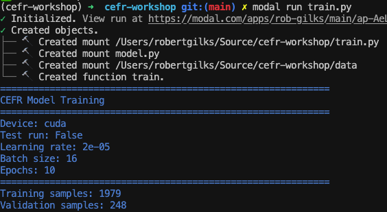

# CEFR Scoring with DeBERTa-v3



**Prerequisites**: Python basics, command line familiarity  
**Target Audience**: Software engineers new to ML

---

## 🚀 Quick Start (Do This First!)

### Prerequisites

**macOS users** - Install Python 3.12+ if you don't have it:
```bash
# Option 1: Using Homebrew (recommended)
brew install python@3.12

# Option 2: Download from python.org
# https://www.python.org/downloads/
```

**Install uv** - A fast Python package manager:
```bash
# macOS/Linux
curl -LsSf https://astral.sh/uv/install.sh | sh

# Or with Homebrew
brew install uv
```

### Get the Training Data

**Get the Write & Improve corpus** - this is the training data:
1. Go to: https://englishlanguageitutoring.com/datasets/write-and-improve-corpus-2024
2. Fill out the request form (access is typically granted immediately)
3. Download and unzip the corpus

### Setup

#### 1. Clone and Install
```bash
git clone https://github.com/rgilks/cefr-workshop.git
cd cefr-workshop

# Install all dependencies (uv handles Python version automatically)
uv sync
```

#### 2. Verify Your Setup
```bash
# This should print "✅ Model test passed!" (downloads ~400MB model)
uv run python model.py
```

**What this tests**: This verifies that the pre-trained DeBERTa model downloads and loads correctly. You'll see "Sample scores" with random numbers like `[0.31, 0.08]` - these are **meaningless** because the regression head is untrained. After training, scores will be valid CEFR values (1.0-6.0).

#### 3. Prepare the Training Data

```bash
# Once you download and unzip the corpus from Cambridge:
# https://englishlanguageitutoring.com/datasets/write-and-improve-corpus-2024
# 
# The 2024 corpus extracts to a folder like: write-and-improve-corpus-2024-v2/
# Point the script to the whole-corpus subdirectory:

uv run python prepare_data.py \
    --input-dir /path/to/write-and-improve-corpus-2024-v2/whole-corpus \
    --output-dir ./data
```

#### 4. Set Up Modal (Cloud GPUs)
```bash
uv run modal setup              # Follow the prompts to authenticate
uv run modal run hello_modal.py # Verify Modal works (prints "Hello from modal!")
```

#### 5. Run Training
```bash
# Quick test first (~5 min, verifies everything works)
uv run modal run train.py --test-run

# Then full training (~30-60 min on A10G GPU)
uv run modal run train.py
```

You're all set! Continue to [Part 1](#part-1-understanding-the-problem) to learn what you're building, or skip ahead to [Part 6](#part-6-training--evaluation) if you just want to train.

---

## 🎯 What You'll Build

A machine learning model that reads English essays and predicts their CEFR level (A1→C2). By the end, you'll understand:

- How transformer models "read" text
- The training loop (forward pass → loss → backpropagation)
- Running GPU workloads on Modal
- Evaluating model quality with proper metrics

---

## 📁 Project Structure

```
cefr-workshop/
├── README.md                 # This file - workshop guide
├── pyproject.toml            # Python dependencies (used by uv)
├── model.py                  # Model architecture (run to verify setup)
├── train.py                  # Training script for Modal
├── evaluate.py               # Evaluation script
├── serve.py                  # API deployment
├── hello_modal.py            # Quick test for Modal setup
├── prepare_data.py           # Converts W&I corpus to training format
└── data/                     # Training data (created by prepare_data.py)
    ├── train.jsonl
    ├── dev.jsonl
    └── test.jsonl
```

---

## 📚 Table of Contents

1. [Understanding the Problem](#part-1-understanding-the-problem)
2. [The Dataset: Write & Improve Corpus](#part-2-the-dataset)
3. [How DeBERTa Works (Conceptually)](#part-3-how-deberta-works)
4. [Setting Up Modal](#part-4-setting-up-modal)
5. [Understanding the Code](#part-5-understanding-the-code)
6. [Training & Evaluation](#part-6-training--evaluation)
7. [Deployment & Inference](#part-7-deployment--inference)
8. [Additional Datasets](#-additional-datasets)

---

## Part 1: Understanding the Problem

### What is CEFR?

The **Common European Framework of Reference for Languages** (CEFR) is the international standard for describing language ability:

| Level | Description | Can Do |
|-------|-------------|--------|
| **A1** | Beginner | Basic phrases, simple questions |
| **A2** | Elementary | Routine tasks, simple descriptions |
| **B1** | Intermediate | Main points, travel situations |
| **B2** | Upper-Intermediate | Complex texts, fluent interaction |
| **C1** | Advanced | Implicit meaning, flexible language |
| **C2** | Mastery | Effortless, precise expression |

### Why Automate This?

- Human scoring is expensive (~$10-50 per essay)
- Bottleneck for language learning platforms
- Models can provide instant feedback

### The ML Framing

This is a **regression problem**:
- **Input**: Essay text (string)
- **Output**: Score 1.0-6.0 (continuous, mapped to CEFR levels)


---

## Part 2: The Dataset

### Write & Improve Corpus

The [Write & Improve (W&I) corpus](https://englishlanguageitutoring.com/datasets/write-and-improve-corpus-2024) is from Cambridge English:

- **~2,500 essays** from real English learners (final versions with CEFR labels)
- **Expert CEFR labels** by trained examiners
- **Open access** for research
- Pre-split into train/dev/test sets

### Obtaining the Data

```bash
# 1. Request access from Cambridge
# https://englishlanguageitutoring.com/datasets/write-and-improve-corpus-2024
# Fill out the form - usually approved within 24 hours

# 2. Once you receive the download link, unzip it.
# The 2024 version extracts to: write-and-improve-corpus-2024-v2/
```

### Data Structure

The 2024 corpus is a single TSV file (`whole-corpus/en-writeandimprove2024-corpus.tsv`) with columns:

| Column | Description |
|--------|-------------|
| `text` | The essay text |
| `automarker_cefr_level` | CEFR level from auto-marker |
| `humannotator_cefr_level` | CEFR level from human (if available) |
| `split` | train / dev / test |
| `is_final_version` | TRUE for final drafts |

### CEFR to Numeric Mapping

For regression, we convert CEFR to numbers:

```python
CEFR_TO_SCORE = {
    "A1": 1.0,
    "A2": 2.0,
    "B1": 3.0,
    "B2": 4.0,
    "C1": 5.0,
    "C2": 6.0,
}
```

> ⚠️ **Note**: The W&I corpus primarily contains B1-B2 essays (~75%). Very few A1 or C2 examples exist.

---

## Part 3: How DeBERTa Works

### The Big Picture

**DeBERTa-v3** is a pre-trained language model from Microsoft. Think of it as a "brain" that already understands English - it was trained on billions of words from the internet.

**What we do**: We add a small "scoring layer" on top and teach it to predict CEFR levels. This is called **fine-tuning** - we don't train the whole model from scratch, we just adjust it for our specific task.

```
Pre-trained DeBERTa (understands English)
         ↓
    Our scoring layer (learns CEFR)
         ↓
    CEFR Score (1.0 - 6.0)
```

### Why This Works

DeBERTa uses **attention** to understand context. For example, in "The bank by the river", it learns that "bank" relates to "river" (riverbank) rather than money.

This contextual understanding is exactly what's needed for CEFR scoring - the model can recognize patterns like:
- Simple vs complex sentence structures
- Basic vs advanced vocabulary
- Grammatical accuracy

### Want to Understand the Details?

These resources explain the underlying concepts:

- **[The Illustrated Transformer](https://jalammar.github.io/illustrated-transformer/)** - Visual guide to how attention works
- **[The Illustrated BERT](https://jalammar.github.io/illustrated-bert/)** - How pre-training works (applies to DeBERTa)
- **[DeBERTa Paper](https://arxiv.org/abs/2006.03654)** - The original research paper

---

## Part 4: Setting Up Modal

### What is Modal?

Modal is a cloud platform for running Python functions on GPUs. Think of it as "serverless for ML":

```python
@app.function(gpu="A10G")
def train():
    # This runs on a GPU in the cloud
    pass
```

### Installation

Modal is already included in the project dependencies (`pyproject.toml`). After running `uv sync`:

```bash
# 1. Authenticate (creates ~/.modal.toml)
uv run modal setup

# 2. Verify
uv run modal run --help
```

### Modal Concepts

| Concept | Description |
|---------|-------------|
| **App** | Container for your functions |
| **Image** | Docker-like environment specification |
| **Volume** | Persistent storage across runs |
| **Secret** | Secure credential storage |

### Your First Modal Script

The repo includes `hello_modal.py` to verify your Modal setup:

```python
import modal

app = modal.App("hello-workshop")

@app.function()
def hello():
    import platform
    return f"Hello from {platform.node()}!"

@app.local_entrypoint()
def main():
    print(hello.remote())
```

Run it:
```bash
uv run modal run hello_modal.py
# Output: Hello from modal!
```

---


## Part 5: Understanding the Code

The project contains five main Python files. Here's what each does:

### `prepare_data.py` - Data Preparation

Converts the W&I corpus TSV file into training format (JSONL):
- Reads essays from the corpus
- Uses the official train/dev/test splits
- Converts CEFR levels (A1-C2) to numbers (1.0-6.0)

**Key concept**: CEFR levels are converted to numbers for regression:
```python
CEFR_TO_SCORE = {"A1": 1.0, "A2": 2.0, "B1": 3.0, "B2": 4.0, "C1": 5.0, "C2": 6.0}
```

### `model.py` - Model Architecture

Defines the neural network:
- Loads pre-trained DeBERTa from Hugging Face
- Adds a "regression head" (small neural network) on top
- Outputs a score between 1.0-6.0

Run it to verify your setup: `uv run python model.py`

### `train.py` - Training Script

Runs on Modal with a GPU:
- Loads essays and tokenizes them
- Trains the model for 10 epochs
- Saves the best model based on validation MAE

**Modal decorators** make this run in the cloud:
```python
@app.function(gpu="A10G")  # Runs on an A10G GPU
def train():
    # Training code here
```

### `evaluate.py` - Model Evaluation

Tests the trained model on held-out data:
- Loads the best model from Modal volume
- Runs batched inference on the test set
- Reports MAE, QWK, exact accuracy, and per-level breakdown

### `serve.py` - API Deployment

Deploys the trained model as a REST API:
- Loads the model from Modal volume
- Exposes `/score` endpoint for predictions
- Returns CEFR level and confidence

---

## Part 6: Training & Evaluation

### Running Training

```bash
# Quick test (verifies everything works, ~5 min)
uv run modal run train.py --test-run

# Full training (~30-60 min)
uv run modal run train.py
```

> **How `--test-run` works**: Modal forwards CLI arguments to the `@app.local_entrypoint()` function. The `test_run: bool = False` parameter is automatically converted from the `--test-run` flag. This is a standard Modal feature for parameterizing remote functions.

### Understanding the Output

```
Epoch 1/10
  Train Loss: 0.8234
  Dev MAE: 0.52
  ✅ New best model saved!

Epoch 2/10
  Train Loss: 0.4123
  Dev MAE: 0.41
  ✅ New best model saved!
  
...
```

**Key Metrics**:

| Metric | What It Means | Good Value |
|--------|---------------|------------|
| **Train Loss** | MSE on training data | Decreasing |
| **Dev MAE** | Mean Absolute Error on validation | < 0.5 |

### What is MAE?

**Mean Absolute Error** = average of `|predicted - actual|`

```python
# Example:
predictions = [3.2, 4.1, 2.8]
actuals     = [3.0, 4.0, 3.0]
errors      = [0.2, 0.1, 0.2]
MAE = average(errors) = 0.167
```

An MAE of 0.4 means predictions are within half a CEFR level on average.

### Running Evaluation

After training, test your model on held-out data:

```bash
uv run modal run evaluate.py
```

The `evaluate.py` script:
- Loads your trained model from Modal volume
- Runs predictions on all test essays
- Reports MAE, QWK, and accuracy metrics

Example output:
```
============================================================
EVALUATION RESULTS
============================================================
Samples:           262
MAE:               0.421
QWK:               0.812
Exact Accuracy:    58.2%
Adjacent Accuracy: 91.4%

Per-Level MAE:
  A1: 0.312 (n=6)
  A2: 0.387 (n=35)
  B1: 0.354 (n=105)
  B2: 0.401 (n=92)
  C1: 0.823 (n=17)
  C2: 0.951 (n=7)
============================================================
```

> Note: Your results will vary. C1/C2 levels typically have higher error due to limited training data.

### Understanding QWK (Quadratic Weighted Kappa)

QWK measures agreement between predicted and actual CEFR levels:

| QWK Value | Interpretation |
|-----------|----------------|
| 1.0 | Perfect agreement |
| 0.8-1.0 | **Excellent** (human-level) |
| 0.6-0.8 | Good |
| 0.4-0.6 | Moderate |
| < 0.4 | Needs improvement |

> 💡 **Why QWK?** Unlike accuracy, QWK penalizes larger errors more. Predicting C2 when the actual is A2 is much worse than predicting B2.

---

## Part 7: Deployment & Inference

### Deploying the API

The `serve.py` file deploys your trained model as a REST API:

```bash
uv run modal deploy serve.py
```

This gives you a persistent URL like `https://your-username--cefr-api-cefrservice-serve.modal.run`

### API Endpoints

| Endpoint | Method | Description |
|----------|--------|-------------|
| `/health` | GET | Check if model is loaded |
| `/score` | POST | Score an essay |

### Understanding the Response

The `/score` endpoint returns three fields:
- **`score`**: Numeric prediction on the 1.0-6.0 scale
- **`cefr_level`**: The CEFR level derived from the score (A1-C2)
- **`confidence`**: A heuristic based on how far the score is from the nearest CEFR boundary. Scores near boundaries (e.g., 2.48, right between A2 and B1) get `"low"` confidence, while scores firmly within a level (e.g., 3.1, clearly B1) get `"high"`. This is **not** a model calibration metric — it simply flags borderline cases.

### Testing the API

Try these sample essays at different CEFR levels:

**A1 Level** (very simple, fragmented):
```bash
curl -X POST https://YOUR-URL/score -H "Content-Type: application/json" \
  -d '{"text": "I am student. I like school. My teacher is nice. I have friend. We play."}'
# Expected: A1-A2 (score ~1.7)
```

**A2 Level** (simple sentences, basic connectors):
```bash
curl -X POST https://YOUR-URL/score -H "Content-Type: application/json" \
  -d '{"text": "I like to go shopping with my friends. We go to the mall every weekend. I usually buy clothes and sometimes we eat pizza. It is very fun."}'
# Expected: A2-B1 (score ~2.5)
```

**B1 Level** (connected, clear, personal topics):
```bash
curl -X POST https://YOUR-URL/score -H "Content-Type: application/json" \
  -d '{"text": "Last weekend I visited my grandmother. She lives in a small village near the mountains. We cooked dinner together and talked about old times. I really enjoyed spending time with her."}'
# Expected: B1 (score ~2.8)
```

**B2 Level** (clear, detailed, can argue a point):
```bash
curl -X POST https://YOUR-URL/score -H "Content-Type: application/json" \
  -d '{"text": "The question of whether social media has had a positive or negative impact on society is complex. On one hand, platforms like Facebook have enabled unprecedented global connectivity. On the other hand, there is growing evidence that excessive use may contribute to mental health issues, particularly among young people."}'
# Expected: B2 (score ~3.8)
```

**C1/C2 Level** (sophisticated, nuanced):
```bash
curl -X POST https://YOUR-URL/score -H "Content-Type: application/json" \
  -d '{"text": "The proliferation of misinformation in digital spaces represents a fundamental challenge to democratic discourse. While technological solutions such as fact-checking algorithms offer some mitigation, the underlying issue stems from deeper epistemological fragmentation in contemporary society."}'
# Expected: B2-C1 (score ~3.8) - Note: Model tends to underpredict C1/C2 due to limited training examples at these levels
```

---

## ⚠️ Known Limitations & Improvements

### The C1/C2 Problem

The model tends to underpredict C1 and C2 levels because the W&I corpus has very few examples at these levels (~35 essays combined vs ~200 at B2). This is a common data imbalance issue.

### Ways to Improve the Model

1. **Data augmentation**: Generate synthetic C1/C2 essays using GPT-4, or paraphrase existing ones
2. **Class weighting**: Weight the loss function to penalize C1/C2 errors more heavily
3. **[Ordinal regression](https://arxiv.org/abs/2111.08851)**: Use CORN or other ordinal loss functions that respect the A1→C2 ordering
4. **[Larger model](https://huggingface.co/microsoft/deberta-v3-large)**: Try `microsoft/deberta-v3-large` (304M backbone params vs 86M for base)
5. **Ensemble**: Train 3-5 models with different seeds and average predictions
6. **Additional data**: Combine with other corpora - see [Additional Datasets](#-additional-datasets) below

---

## 📖 Reference Materials

### Essential Reading (Do These First)

1. **[The Illustrated Transformer](https://jalammar.github.io/illustrated-transformer/)** - Visual guide to attention
2. **[The Illustrated BERT](https://jalammar.github.io/illustrated-bert/)** - How pre-training works
3. **[But what is a GPT?](https://www.youtube.com/watch?v=wjZofJX0v4M)** - 3Blue1Brown video

### Technical Documentation

- [Hugging Face Transformers](https://huggingface.co/docs/transformers) - Library docs
- [Modal Documentation](https://modal.com/docs/guide) - Cloud platform
- [DeBERTa Paper](https://arxiv.org/abs/2006.03654) - Original research
- [W&I Corpus](https://englishlanguageitutoring.com/datasets/write-and-improve-corpus-2024) - Dataset source

### CEFR Background

- [CEFR Overview](https://www.coe.int/en/web/common-european-framework-reference-languages) - Official Council of Europe
- [CEFR Level Descriptors](https://www.cambridgeenglish.org/exams-and-tests/cefr/) - Cambridge English

---

## 📊 Additional Datasets

These datasets aren't CEFR-specific but may be useful for related essay scoring or learner language research:

### DREsS (Dataset for Rubric-based Essay Scoring)

**[DREsS](https://haneul-yoo.github.io/dress/)** - Published at ACL 2025, this large-scale dataset focuses on rubric-based scoring for EFL writing:
- **DREsS_New**: 2,279 essays from EFL learners scored by experts
- **DREsS_Std**: 6,515 essays aggregated from existing datasets
- **DREsS_CASE**: 40,185 synthetic essay samples
- Scoring: 1-5 scale across three rubrics (content, organization, language)

### ASAP (Automated Student Assessment Prize)

**[ASAP AES](https://www.kaggle.com/c/asap-aes)** - The original Kaggle essay scoring competition dataset:
- ~13,000 essays across 8 prompts from US high school students (grades 7-10)
- Holistic scores with some trait-level annotations

**[ASAP 2.0](https://www.kaggle.com/competitions/learning-agency-lab-automated-essay-scoring-2)** - Updated 2024 dataset:
- ~24,000 argumentative essays
- Scored 1-6 scale
- Focus on demographic diversity to reduce algorithmic bias

### ICNALE (International Corpus Network of Asian Learners of English)

**[ICNALE](http://language.sakura.ne.jp/icnale/)** - Topic-controlled corpus from Asian learners:
- 5,600+ essays (200-300 words each) from 10 Asian countries/regions
- Includes proficiency levels mapped to CEFR via TOEIC/TOEFL/IELTS scores
- **Edited Essays** module includes professional corrections and rubric-based scores
- Open access with online query interface

### EFCAMDAT (EF-Cambridge Open Language Database)

**[EFCAMDAT](https://corpus.mml.cam.ac.uk/efcamdat2/)** - Large-scale learner corpus from EF Education First:
- 83+ million words from 1 million assignments
- 174,000 learners across CEFR levels A1-C2
- Includes error annotations, POS tagging, and grammatical relationships
- Requires free registration for access

### Other Notable Resources

- **[Kaggle ELL Feedback Prize](https://www.kaggle.com/competitions/feedback-prize-english-language-learning)** - Essays with trait-level scores
- **[TOEFL11](https://catalog.ldc.upenn.edu/LDC2014T06)** - Essays with coarse proficiency labels (low/medium/high)

---

## ⚖️ License & Compliance Warning

This project uses the **Write & Improve Corpus 2024** from Cambridge University Press & Assessment. By using this data, you agree to their [Terms and Conditions](https://englishlanguageitutoring.com/datasets/write-and-improve-corpus-2024).

**IMPORTANT Restrictions:**
1. **Non-Commercial**: You may not use this data or trained models for commercial products.
2. **No Model Redistribution**: You are **strictly prohibited** from publishing models trained on this data (e.g., uploading `best_model.pt` to Hugging Face Hub).
3. **Data Privacy**: Do not redistribute the raw dataset.

This workshop is for educational purposes only.
